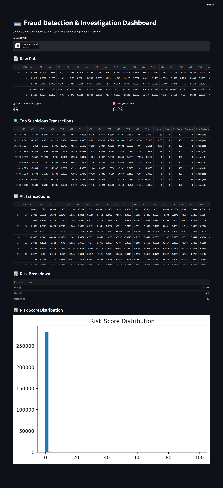

# 💳 Fraud Detection & Investigation Dashboard

An end-to-end machine learning system for detecting and investigating fraudulent transactions using a hybrid approach.

---

## 🚀 Overview

This project combines:

* **Random Forest** for supervised fraud detection
* **Isolation Forest** for anomaly detection
* A **hybrid decision system** to balance precision and recall

The system prioritizes **high recall** to minimize missed fraud while maintaining manageable false positives.

---

## ⚙️ Key Features

* Upload transaction dataset (CSV)

* Risk scoring for each transaction

* Hybrid fraud detection logic:

  ```python
  if risk > 40 or (risk > 20 and anomaly == -1)
  ```

* Top suspicious transactions ranking

* Risk distribution visualization

* Clean Streamlit dashboard UI

---

## 📊 Model Performance

* **Precision:** 0.90
* **Recall:** 0.83
* Designed to prioritize catching fraud over minimizing false alerts

---

## 🧠 Key Learnings

* Handling **class imbalance** in fraud detection
* Importance of **feature consistency** between training and inference
* Trade-offs between **precision vs recall**
* Challenges of **distribution mismatch in synthetic data**
* Building an **end-to-end ML system**, not just a model

---

## 🖥️ Demo



---

## ▶️ Run Locally

```bash
pip install -r requirements.txt
streamlit run app.py
```

---

## 📁 Dataset

Based on the Credit Card Fraud Detection dataset (Kaggle)


```
```
